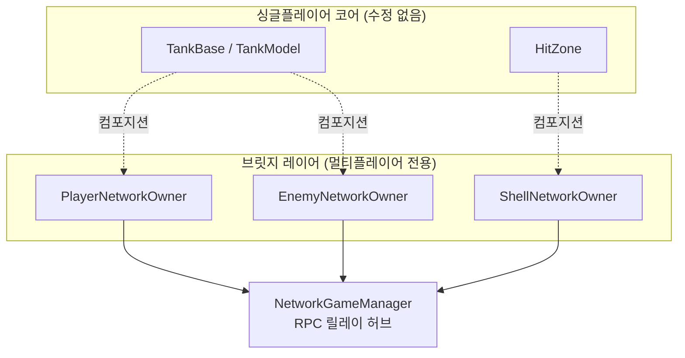
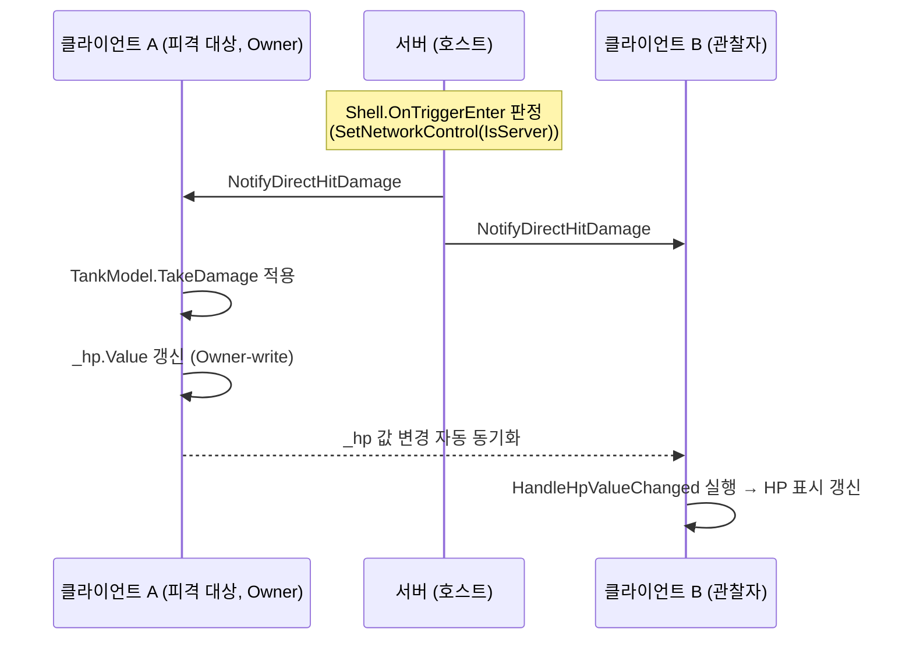

# PanzerCity

숄더뷰 3인칭 시점의 탑다운 아케이드 탱크 슈팅 게임입니다. 게임 프로그래밍 교육 과정 중 기획부터 구현까지 혼자 진행한 개인 프로젝트로, **Steam 무료 출시를 준비하고 있습니다.** 싱글플레이어와 최대 4인 협동 멀티플레이어를 모두 지원합니다.

> 이 저장소는 전체 Unity 프로젝트 중 스크립트(C#) 폴더만 발췌한 코드 샘플입니다. 유료 에셋 등 리소스 파일은 라이선스상 포함되어 있지 않습니다.

## 플레이 영상

[](https://youtu.be/MnOQQwJs6_s)

*▶ 클릭하면 유튜브에서 재생됩니다*

## 기술 스택

- Unity 6000.3.7f1 (URP)
- Netcode for GameObjects, Unity Lobby Service, Unity Relay
- TextMeshPro, New Input System, Cinemachine
- Unity Localization
- DoTween

## 아키텍처 하이라이트

### 싱글플레이어를 침범하지 않는 멀티플레이어 확장

싱글플레이어 코드 경로는 전혀 수정하지 않는 것을 원칙으로 삼았습니다. 멀티플레이어 로직은 `EnemyNetworkOwner`, `PlayerNetworkOwner`, `ShellNetworkOwner` 같은 브릿지 컴포넌트를 기존 오브젝트에 컴포지션으로 추가하는 방식으로만 구현했습니다.

```csharp
// PlayerTank.cs — Attack()
if (_networkOwner != null)
{
    if (_networkOwner.IsServer) _networkOwner.HandleAttackOnServer(_firePoint.position, _firePoint.rotation); // 호스트 자신이면 바로 처리
    else _networkOwner.RequestAttackServerRpc(_firePoint.position, _firePoint.rotation); // 비호스트면 서버에 요청
}
else
{
    SpawnShell(); // 싱글플레이
}
```

`_networkOwner`의 null 여부가 싱글/멀티 컨텍스트를 판별하는 표준 관용구이고, `NetworkGameManager`가 모든 RPC를 중계하는 허브 역할을 합니다. 이 구조 덕분에 멀티플레이어 기능을 추가하거나 디버깅할 때 싱글플레이어 쪽을 회귀 테스트할 필요가 없습니다.



### 서버 권위 판정 + 클라이언트 로컬 재현

포탄(Shell)과 적 탱크(EnemyTank)의 충돌 판정 및 이동 갱신은 각각 `ShellNetworkOwner`, `EnemyNetworkOwner`가 호출하는 `SetNetworkControl(IsServer)`로 가드되어 있어, 데미지 판정 자체는 항상 서버에서만 실행됩니다. 판정 결과는 `NotifyDirectHitDamage`, `NotifyExplosionDamage`로 모든 클라이언트에 전파되고, 각 클라이언트는 이 이벤트를 받아 로컬에서 동일한 결과를 재현합니다.

이 HP 값을 다른 클라이언트 화면에 보여주는 방식은 대상마다 다릅니다. 적 탱크는 판정 이벤트 전파만으로 충분해서 별도 동기화 변수를 두지 않았지만, 플레이어 탱크(`PlayerNetworkOwner`)는 `NetworkVariable<int> _hp`(Owner-write, Everyone-read)를 따로 둡니다. 소유 클라이언트가 서버 판정 결과를 반영해 로컬에서 확정한 HP 값을 그대로 이 변수에 실어 보내면, 나머지 클라이언트는 값 변경 이벤트만 구독해서 화면에 반영합니다. 판정의 최종 권위는 여전히 서버에 있고, 이 변수는 그 결과를 다른 클라이언트에 편하게 퍼뜨리기 위한 경로일 뿐입니다.

```csharp
// PlayerNetworkOwner.cs
NetworkVariable<int> _hp = new NetworkVariable<int>(0, NetworkVariableReadPermission.Everyone, NetworkVariableWritePermission.Owner);

void HandleLocalHpChanged(int current, int max) => _hp.Value = current;

void HandleHpValueChanged(int previousValue, int currentValue)
{
    if (IsOwner) return; // 오너 자신은 TakeDamage에서 이미 직접 반영
    _playerTank.ApplySyncedHp(currentValue);
}
```



이 구조에 도달하기까지의 과정은 아래 트러블슈팅 섹션의 "멀티플레이어 판정 주체 실험" 항목에 정리했습니다.

## 왜 이렇게 만들었는가 — 트러블슈팅 & 설계 결정

기능을 완성하는 것보다, 왜 그렇게 만들었고 어떤 시행착오를 거쳤는지가 더 중요하다고 생각합니다. 실제로 겪었던 문제와 해결 과정 중 일부를 정리했습니다.

### 1. 적 AI — 이동과 회전 분리

NavMesh 에이전트는 경로 계산에만 쓰고, 회전은 별도 로직으로 직접 제어하고 싶었습니다. `agent.updatePosition = false`, `agent.updateRotation = false`로 꺼두었는데도 에이전트가 미세하게 위치를 갱신하는 현상이 있어서, `agent.speed = 0`으로 강제 고정해 해결했습니다. 이 과정에서 경로가 순간적으로 튀는(jitter) 현상도 발견했는데, 오히려 Speed 값을 다시 채워주는 방식으로 함께 해결했습니다.

### 2. 조준 하이라이트 — 아웃라인에서 실루엣으로 전환

조준한 적에게 아웃라인을 표시하려고 셰이더와 셰이더 그래프로 여러 방식을 시도했지만 난이도가 높아, 실루엣 방식으로 방향을 바꿨습니다. 처음에는 실루엣을 적 탱크 위에 겹쳐 그리고 CustomRenderQueue로 그려지는 순서만 늦추는 방식을 썼는데, 다른 탱크에 가려질 때는 실루엣이 표시되지 않는 문제가 있었습니다. 이를 렌더러의 스텐실(Stencil) 값을 이용하는 방식으로 다시 구현했습니다 — 조준된 탱크 모델의 레이어를 바꾸고, 그 레이어가 다른 오브젝트에 가려질 때만 실루엣 레이어에 색이 칠해지도록 처리해 해결했습니다.

### 3. 조준점 위치 보정

화면 정중앙을 기본 조준 위치로 쓰되, 3인칭 시점에서는 캐릭터에 가려지는 문제가 있어 화면의 0.75 지점으로 오프셋을 줬습니다. 시점 전환 시 조준점이 흔들리는 현상은 별도 보정 로직으로, 너무 가까운 대상을 조준할 때 조준점이 위쪽을 가리키던 문제는 근접 거리에서 조준점 계산 자체를 생략하는 방식으로 해결했습니다.

### 4. 멀티플레이어 판정 주체 실험

처음에는 포탄의 이동과 충돌 판정을 모두 서버 권위로 구현했습니다. 반응성을 개선하고 싶어서 피격/파괴 판정만 클라이언트 권위로 바꿔봤는데, 포탄 생성은 서버가 하고 판정은 클라이언트가 하다 보니 포탄 위치 동기화 오차로 실제로 맞지 않은 플레이어가 피격 처리되거나 벽 뒤에서 포탄이 터지는 버그가 발생했습니다. 판정 일관성이 반응성보다 중요하다고 판단해 전체 서버 권위 구조로 되돌렸고, 이게 지금의 아키텍처입니다.

### 5. 풀숲 오브젝트 최적화

겹치는 풀숲 오브젝트를 매번 수동으로 끄고 연결해주는 작업이 번거로워서, 에디터 스크립팅으로 이 과정을 자동화했습니다.

### 6. Pool 네트워크 ID 재사용 버그

멀티플레이어 진행 중 아이템 드랍이나 적 스폰 시 간헐적으로 에러가 발생했습니다. 원인은 아이템과 적 스폰이 동일한 Pool을 공유하는데, 포탄을 실수로 두 번 반환하면서 네트워크 ID가 꼬였기 때문이었습니다 (싱글플레이어에서도 한 번 겪었던 문제입니다). Pool에 중복 반환을 막는 가드를 추가해 해결했습니다.

### 7. 호스트 send queue full 에러

호스트에서 간헐적으로 매 프레임 발생하던 네트워크 에러입니다. 적이 두 번 발사되는 버그가 있어 배회/교전 타이머를 초기화하는 방식으로 수정했는데, 장전 시간과 타이머 값이 꼬이면서 에러가 발생했던 것으로 추정하고 있습니다. 타이머 수정 이후로는 에러가 재현되지 않았습니다.

## 멀티플레이어 설계 과정

### 설정 근거

Unity Multiplayer 패키지 설정 마법사에서 각 항목을 다음과 같이 선택했습니다.

| 항목 | 선택 | 이유 |
| --- | --- | --- |
| Gameplay Pace | Fast | 탱크 전투는 빠른 반응이 필요한 액션 장르 |
| Cheating/Modding Prevention | Not so important | PvE 협동 위주 프로젝트라 치팅 방지보다 개발 비용 절감 우선 |
| Cost Sensitivity | As little cost as possible | 개인 프로젝트로 운영 비용 최소화가 목표 |
| Netcode Architecture | Client/Server | Netcode for GameObjects 기반, 호스트가 서버 역할 겸임 |

### 구현 로드맵

복잡한 멀티플레이어 기획을 8단계로 쪼개서 순차적으로 구현했습니다.

1. 연결 인프라 — 패키지 설치, NetworkManager/LobbyManager 이식
2. 룸 UI — 닉네임 입력, 룸 목록, 슬롯 표시, 준비/시작/강퇴, 채팅
3. 인게임 진입 — 스폰 포인트 배열화, NetworkTransform 동기화
4. 게임 로직 동기화 — 적/아이템 서버 권위 스폰, 골드 처치자 귀속, HQ 파괴 판정
5. 패배/재시작 흐름 — 전체 패배 → 카운트다운 → 재시작/포기 → 룸 복귀
6. 관전 모드 — 목숨 소진 플레이어 관전 카메라, 다음 스테이지 부활 처리
7. 상점 동기화 — 커서 공유, 준비 버튼, 타임아웃 자동 진행
8. 싱글/멀티 분기 정리 — GameScene 분리, 세이브 분기, 싱글 회귀 테스트

현재 핵심 기능(로비 생성/입장, 4인 동시 플레이, 서버 권위 전투 판정, 통계/세이브 동기화)은 구현이 끝났고, 이 상태로 Steam 출시를 준비하고 있습니다.

## 주요 기능

- 그리드 기반 드래그 앤 드롭 인벤토리 (MVP 패턴: `InventoryView` / `ItemView` / `InventoryPresenter`)
- ScriptableObject 기반 아이템 · 장비 설정
- 상점 시스템
- 오브젝트 풀링
- 세이브 / 로드 시스템
- 플레이어별 색상 구분 미니맵
- 로비 · 인게임 채팅 (IME 대응)
- BGM / 사운드 시스템

## 향후 계획

- 캐릭터 선택 시스템
- 신규 맵, 보스 콘텐츠
- 퀘스트 시스템
- 맵 에디터 (Steam 창작마당 연동)

## 개발자

정지수 · [GitHub](https://github.com/gesua) · [Blog](https://blog.naver.com/tenwkao)
